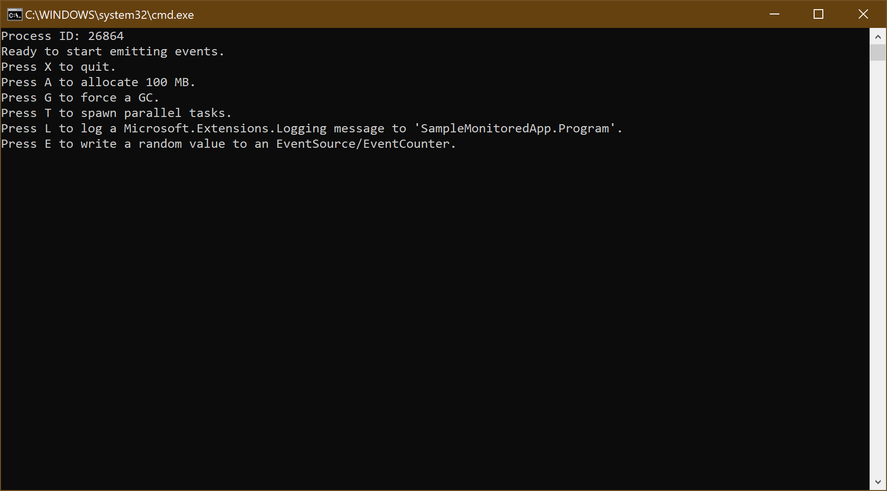
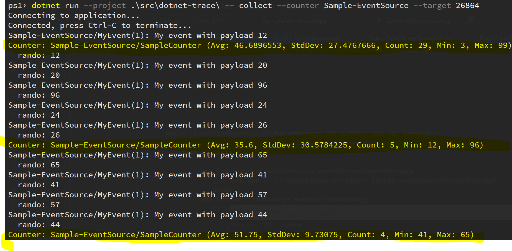
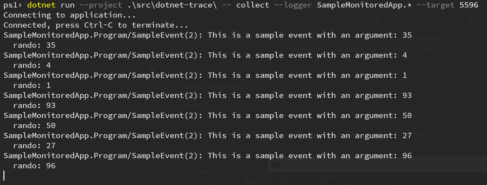

# .NET Diagnostics Tools

This repository contains tools for collecting diagnostics from .NET applications.

## Microsoft.Diagnostics.Server

Install this package in a .NET application and add the following to your Program.cs to start a server that will listen for monitoring tools to connect and control diagnostic services:

```csharp
using Microsoft.Diagnostics.Server;

namespace SampleMonitoredApp
{
    internal class Program
    {
        private static void Main(string[] args)
        {
            DiagnosticServer.Start();

            // The rest of your app...
        }
    }
}
```

With no arguments, the default behavior is to start the server on a Named Pipe with a name based on the process ID. This allows monitoring tools to easily connect, knowing only the process ID. It is also possible to start the server on a Named Pipe specified by the user, a TCP port, or HTTP endpoint in an ASP.NET Core application (coming later).

## Microsoft.Diagnostics.Client

This package contains the Client API for the Diagnostics Protocol. Use the `DiagnosticsClient` class to start a connection to an application:

```csharp
// Connect to process 1234
var client = new DiagnosticsClient("process://1234");

// Connect to named pipe "MyDiagnosticPipe"
var client = new DiagnosticsClient("pipe://MyDiagnosticPipe");

// Connect to TCP endpoint "127.0.0.1:8888"
var client = new DiagnosticsClient("tcp://127.0.0.1:8888");

// Connect to HTTP endpoint "http://localhost:5000/myapp" (Coming later)
var client = new DiagnosticsClient("http://localhost:5000/myapp");
```

Once connected, hook the `OnEventSourceCreated` event to be notified of all `EventSource`s in the application at the time you connect, and to be notified when any new `EventSource`s are created. Hook the `OnEventWritten` event to be notified any time an event is written to an **enable** event source (see below). Hook the `OnEventCounterUpdated` to be notified when an EventCounter update is received.

The Diagnostics Client **automatically** unwraps events that come from the `Microsoft-Extensions-Logging` (MEL) EventSource into a simulated event that appears to come from the MEL Logger itself. See the section on `dotnet-trace` for an example.

See [CollectCommand](src/dotnet-trace/CollectCommand.cs) in `dotnet-trace` for an example.

## dotnet-trace

The `dotnet-trace` tool allows a user to connect to a Diagnostics Server, enable EventSource providers, EventCounter providers, and Microsoft.Extensions.Logging (MEL) loggers, and collect the events they trigger.

The [SampleMonitoredApp](samples/SampleMonitoredApp) sample provides a simple UI to emit some test diagnostics data:



For example, to collect from an EventSource, use the `--provider` option to specify each provider:


(TODO: Configure levels, keywords, arguments, etc.)

To collect EventCounters, use the `--counter` option (currently, this also enables the Events from that source):



To collect MEL loggers, use the `--logger` option and specify a wildcard match (i.e. `Microsoft.AspNetCore.*`):

